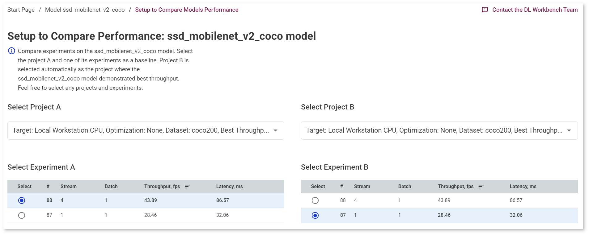
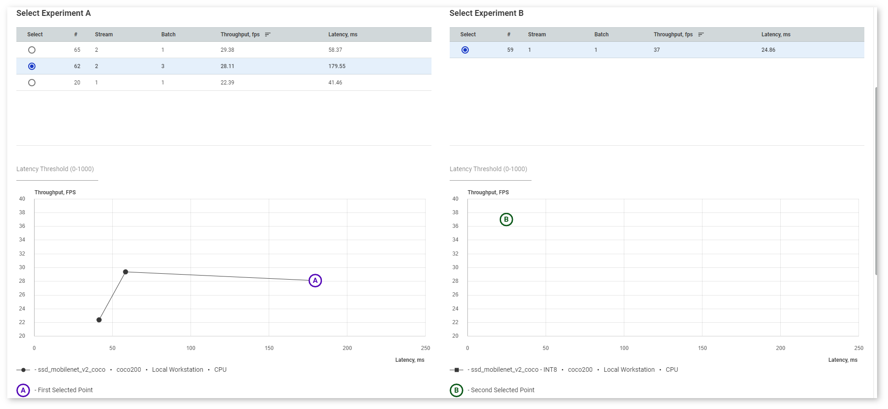
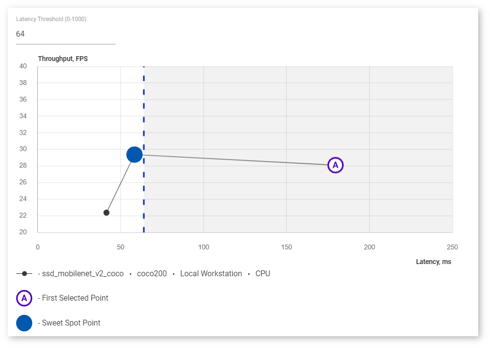
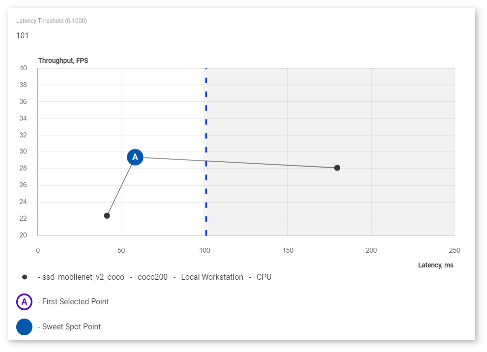
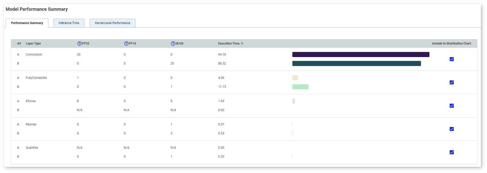
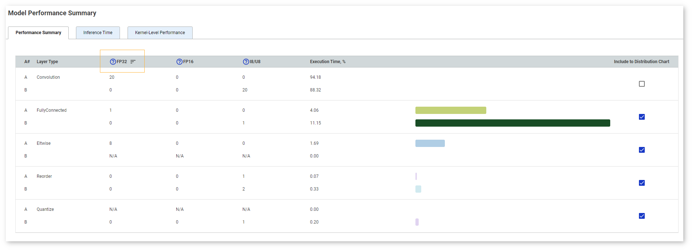

# Compare Performance between Two Versions of a Model {#workbench_docs_Workbench_DG_Compare_Performance_between_Two_Versions_of_Models}

You can compare performance between two versions of a model; for example, between an original FP32 model and an optimized INT8 model. Once the optimization is complete, click **Compare** above the **Projects** table:

The **Setup to Compare Performance** page appears:

Select project A and project B in the drop-down lists. By default, project B is a project with the best throughput.

@sphinxdirective

.. raw:: html

    <iframe  allowfullscreen mozallowfullscreen msallowfullscreen oallowfullscreen webkitallowfullscreen  width="560" height="315" src="https://www.youtube.com/embed/eN0H3s8ITss" frameborder="0" allow="accelerometer; autoplay; encrypted-media; gyroscope; picture-in-picture" allowfullscreen></iframe>

@endsphinxdirective

You can select a certain inference experiment within a project by checking the corresponding row. As you select a version, the graphs with latency and throughput values for both versions appear. The graphs instantly adjust to your selection of versions by adding and removing corresponding points.

Right under the **Inference Results** graph, find the graph legend:
* Line with a squared point stands for a separate configuration (a separate model version, different dataset or target)
* Line with a round point stands for inferences within one configuration
* **A**, **B** points stand for the selected inferences
* Sweet Spot is the configuration with the best throughput given the selected latency threshold

 

In the **Latency Threshold** box, specify the maximum latency value to find the optimal configuration with the best throughput. The point representing the sweet spot becomes a blue filled circle:

If one of the two compared points happens to be a sweet spot, it turns blue while the letter is still indicated:

Click **Compare** to proceed to the detailed analysis. The **Model Performance Summary** section appears. It contains three tabs:
* <a href="#performance-summary">Performance Summary</a>
* <a href="#inference-time">Inference Time</a>
* <a href="#kernel-level-performance">Kernel-Level Performance</a>

## <a name="performance-summary">Performance Summary</a>

**Performance Summary** table contains the table with information on layer types of both
projects, their execution time, and the number of layers of each type executed in a
certain precision. Layer types are arranged from the most to the least time taken. 

The table visually demonstrates the ratio of time taken by each layer type. Uncheck boxes
in the **Include to Distribution Chart** column to filter out certain layers. You can sort layers by any parameter by clicking the name of the corresponding column.

## <a name="inference-time">Inference Time</a>

**Inference Time** chart compares throughput and latency values. By default,
the chart shows throughput values. Switch to **Latency** to see the difference in latency
values.

> **NOTE**: The colors used in the **Inference Time** chart correspond to the colors of the points A and B.

## <a name="kernel-level-performance">Kernel-Level Performance</a>

**Kernel-Level Performance** table shows all layers of both versions of a model. For details on reading the table, see the **Per-Layer Comparison** section of the [Visualize Model](Visualize_Model.md) page.

---
## See Also

* [Visualize Model](Visualize_Model.md)
* [Run Single Inference](Run_Single_Inference.md)
* [View Inference Results](View_Inference_Results.md)
* [Troubleshooting](Troubleshooting.md)
