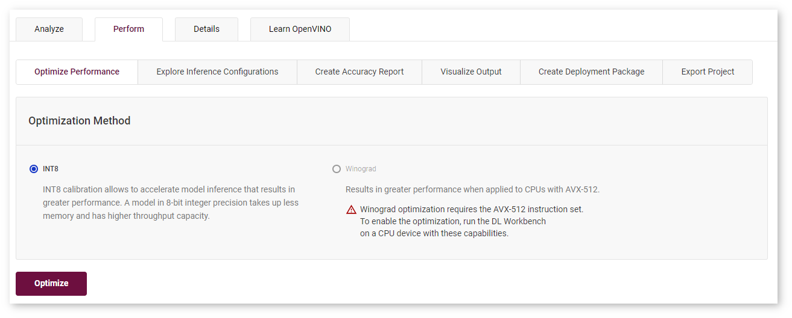
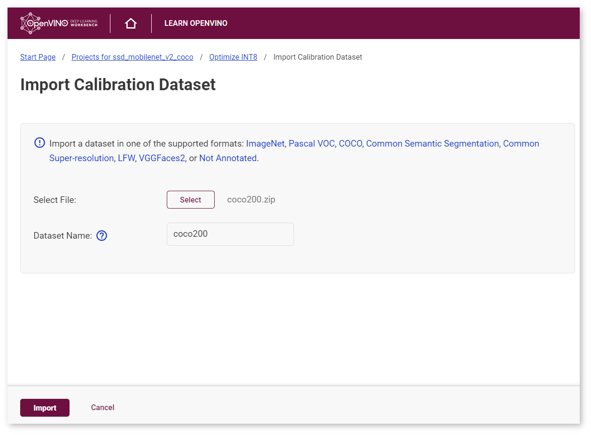
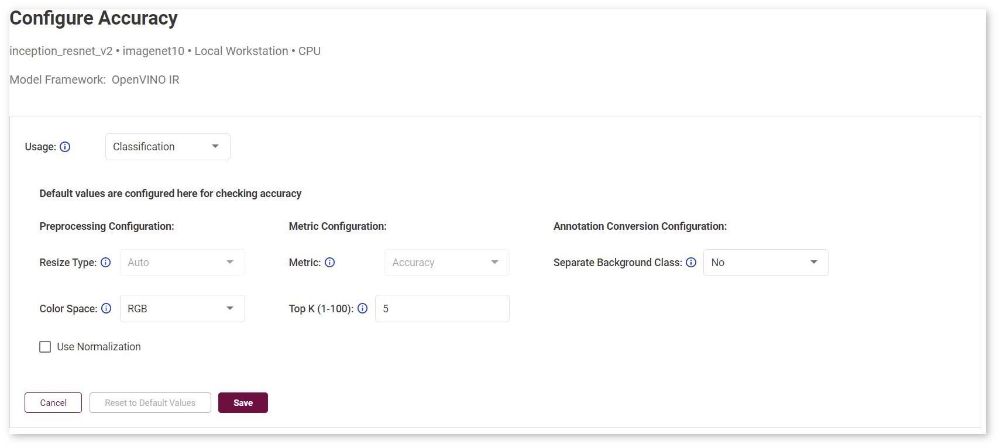
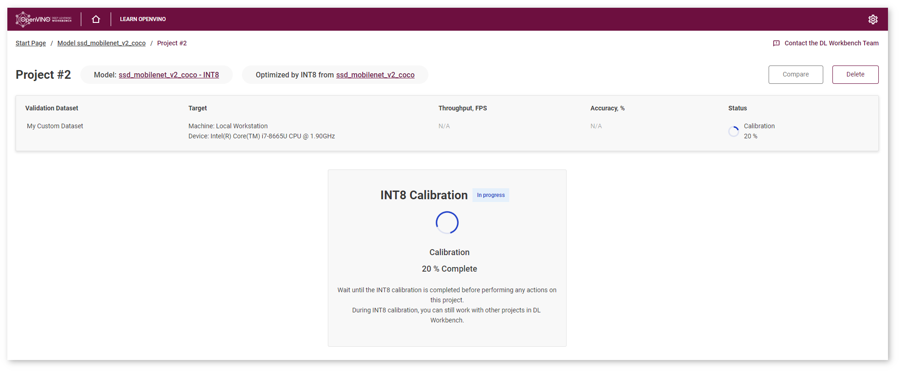

# INT8 Calibration {#workbench_docs_Workbench_DG_Int_8_Quantization}

@sphinxdirective

.. toctree::
   :maxdepth: 1
   :hidden:
   
   workbench_docs_Workbench_DG_Tutorial_Object_Detection
   workbench_docs_Workbench_DG_Tutorial_Classification
   workbench_docs_Workbench_DG_Tutorial_Instance_Segmantation
   workbench_docs_Workbench_DG_Tutorial_Semantic_Segmentation
   workbench_docs_Workbench_DG_Tutorial_Style_Transfer
   workbench_docs_Workbench_DG_Tutorial_Yolo

@endsphinxdirective

DL Workbench can lower the precision of a model from FP32 to INT8 with a process called calibration.
Calibration accelerates the performance of certain models on hardware that supports INT8. A model in INT8 precision takes up less memory and has higher throughput capacity. Often this performance boost is achieved at the cost of a small accuracy reduction. With the DL Workbench, you can calibrate your model locally, on a 
<a href="#remote-calibration">remote target</a>, or in the <a href="#devcloud-calibration">Intel® DevCloud for the Edge</a>.

To read more about INT8 inference, see
[Using Low-Precision INT8 Integer Inference](@ref openvino_docs_IE_DG_Int8Inference) and 
[Post-Training Optimization Toolkit](@ref pot_README).

> **NOTE**: INT8 calibration is **not** available in the following cases: 1. You run the configuration on an Intel® Movidius™ Neural Compute Stick 2, or Intel® Vision Accelerator Design with Intel® Movidius™ VPUs plugin or 2. AccuracyAware method is disabled if your configuration uses a not annotated dataset

## INT8 Calibration Methods

DL Workbench supports two calibration methods: <a href="#default">Default method</a> and <a href="#accuracyaware">AccuracyAware</a>. Each method is further configured with a calibration scheme configuration: the <a href="#performance-preset">performance-oriented preset</a>, which is the default scheme, or the <a href="#mixed-preset">mixed preset</a>. Calibration schemes do not depend on a selected calibration method.

> **TIP**: As a rule, the smaller the calibration subset, the less time the algorithms take. It is recommended to use at least a 3-5% subset of the validation dataset (300-1000 images).

> **NOTE**: A model optimized by the Default method translates all layers that support INT8 execution into INT8 precision, while the AccuracyAware method translates only those layers that both can be executed in INT8 precision and almost do not increase accuracy drop. 

### <a name="default">Default Method</a>

Default method optimizes your model to achieve best performance. The algorithm usually produces the fastest model and usually but not always results in accuracy drop within 1%. Also, this algorithm takes less time than the AccuracyAware optimization method. 

> **NOTE**: This method supports both annotated and not annotated datasets. 
> See [Dataset Types](Dataset_Types.md) for details.

### <a name="accuracyaware">AccuracyAware method</a>

AccuracyAware calibration optimizes your model to achieve best performance possible with the specified maximum acceptable accuracy drop. The AccuracyAware method might result in lower performance compared to the Default method, while the accuracy drop is predictable. Accuracy drop is the difference between the parent model accuracy and the optimized model accuracy. Accuracy of the optimized model is guaranteed to be not smaller than the difference between the parent model accuracy and the accuracy drop.

> **NOTE**: This method supports only annotated datasets.
> See [Dataset Types](Dataset_Types.md) for details.

### <a name="performance-preset">Performance Preset</a>

Performance preset guarantees uncompromising performance of a selected calibration method, as with this preset both weights and activations are calibrated in a symmetric mode. Performance preset is a default option because it provides maximum performance speedup and is independent from a target platform.
 
### <a name="mixed-preset">Mixed Preset</a>

Mixed preset is a tradeoff between accuracy and performance, and with this preset weights and activations are calibrated in symmetric and asymmetric modes correspondingly. Compared to the performance preset, the mixed preset may result in a more accurate model at the cost of performance drop. Depending on a target platform and a model, performance drop usually varies from 5 to 15%. For example, use this preset if a model has convolutional or fully-connected layers with both negative and positive activations, like a model with non-ReLU activations.

## Workflow

@sphinxdirective

.. raw:: html

   <iframe  allowfullscreen mozallowfullscreen msallowfullscreen oallowfullscreen webkitallowfullscreen  width="560" height="315" src="https://www.youtube.com/embed/7XQAZBdA_wo" frameborder="0" allow="accelerometer; autoplay; encrypted-media; gyroscope; picture-in-picture" allowfullscreen></iframe>

@endsphinxdirective

Overall flow for converting a model from FP32 to INT8:

1. [Select an FP32 model](Select_Models.md)
2. [Select an appropriate dataset](Import_Datasets.md)
3. [Run a baseline inference](Work_with_Models_and_Sample_Datasets.md)
4. [Configure INT8 calibration settings and select a calibration dataset](#8-bit-config)
5. [Configure inference settings for a calibrated model](Run_Single_Inference.md)
6. [View INT8 calibration](#review-calibration-progress)
7. [View inference results](View_Inference_Results.md)
8. [Compare the calibrated model with the original FP32 model](Compare_Performance_between_Two_Versions_of_Models.md)

Use the links above to walk through the steps and workflow for creating a calibrated model. 
Topics specific *only* to the INT8 calibration process (steps 4-6) are described below.

## <a name="8-bit-config">Configure INT8 Calibration Settings</a>

Once a model has been profiled by the DL Workbench, you can convert it from FP32 to to
INT8. For non-FP32 models, the INT8 option is grayed out. Go to the **Perform** tab on the
**Projects** page and open the **Optimize** subtab.

> **NOTE:** Using INT8 calibration, you can tune only an original (top-level) model.

Check **INT8** and click **Optimize**. It takes you to the **Optimize INT8** page where you need to:
1. <a href="#dataset">Select or import a calibration dataset</a>.
2. Define the percentage of images to use.
3. <a href="#method">Select an optimization method</a>.
4. Optionally, <a href="#preset">select an optimization scheme</a>.

### <a name="dataset">Select Calibration Dataset</a> (Optional)

> **NOTE**: During the calibration process, a model tends to overfit the dataset its being calibrated on. 
> To avoid overfitting, use separate datasets for calibration and validation.

Select a dataset you want to calibrate the model on, or import a calibration dataset by clicking **Select**:

The **Import Calibration Dataset** page appears. Select the file with a dataset, enter 
the dataset name, and click **Import**:

You are directed back to the **Optimize INT8** page. Specify the percentage of images you will 
use during the calibration procedure in the **Subset Size** box. The default value is 100%.

### <a name="method">Select Optimization Method</a>

Select an optimization method: <a href="#default">Default Method</a> or 
<a href="#accuracyaware">AccuracyAware Method</a>.

For the AccuracyAware option, specify the **Maximum Accuracy Drop** to instruct the DL
Workbench to only convert layers that do not exceed the maximum accuracy drop you can
tolerate. If a layer is estimated to exceed this value, it is not calibrated and remains
at the original precision.

> **NOTE**: See [Configure Accuracy Settings](Accuracy_Configuration.md) for details.

### <a name="preset">Select Calibration Scheme</a> (Advanced)

Calibration scheme is a collection of optimization algorithm parameters that improve a
certain metric of an algorithm. See [optimization parameters](@ref pot_compression_algorithms_quantization_default_README) 
for details.

## <a name="review-calibration-progress">View INT8 Calibration</a>

Click **Calibrate**, and a new project for your model appears. You can work with other projects while the calibration is performed.

## <a name="review-calibration-progress">View INT8 Calibration Results</a>

Optimized model project is available at the Model Page:

Once the job is done, you can compare an optimized model with the original model. For more details, go to
[Compare Performance between Two Versions of Models](Compare_Performance_between_Two_Versions_of_Models.md).

The value of the **outputPrecisions** parameter in the **Layer Name** table for layers of
INT8 optimized models is U8 (INT8 unsigned integer value).

## Remote Calibration

Remote calibration is available only for configurations that use remote machines. To calibrate on a
remote machine, follow the same workflow as for local calibration. However, remote calibration
usually takes some more time due to data exchange between a host machine and a remote machine. Once
inference on the remote machine is complete, the DL Workbench sends the calibrated model to the host
machine and saves it there. 

When you calibrate on a remote system, the progress bar first shows the progress for asset
preparation and upload, and then for calibration and inference:  

## Calibration in the Intel® DevCloud for the Edge

To calibrate on a platform from the [Intel® DevCloud for the Edge](Start_DL_Workbench_in_DevCloud.md), follow the same workflow as for local calibration. 
However, calibration in the DevCloud usually takes some more time due to data exchange between a host machine and a remote machine.

When you calibrate in the DevCloud, the progress bar first shows the progress for asset
preparation and upload, and then for calibration and inference:  

---
## See Also

* [Compare Performance between Two Versions of a Model](Compare_Performance_between_Two_Versions_of_Models.md)
* [Optimization Guide](@ref openvino_docs_optimization_guide_dldt_optimization_guide)
* [Post-Training Optimization Tool](@ref pot_README)
* [Troubleshooting](Troubleshooting.md)