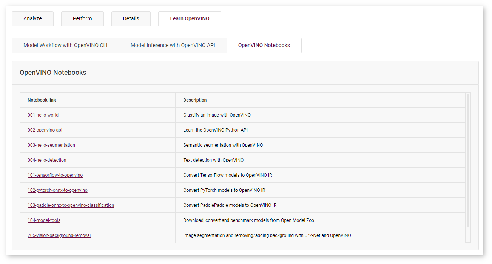
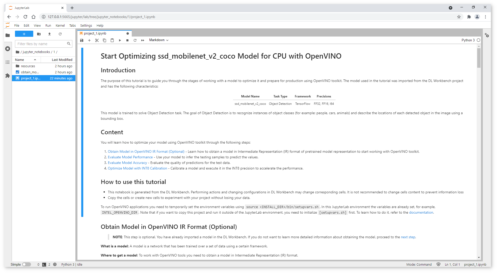
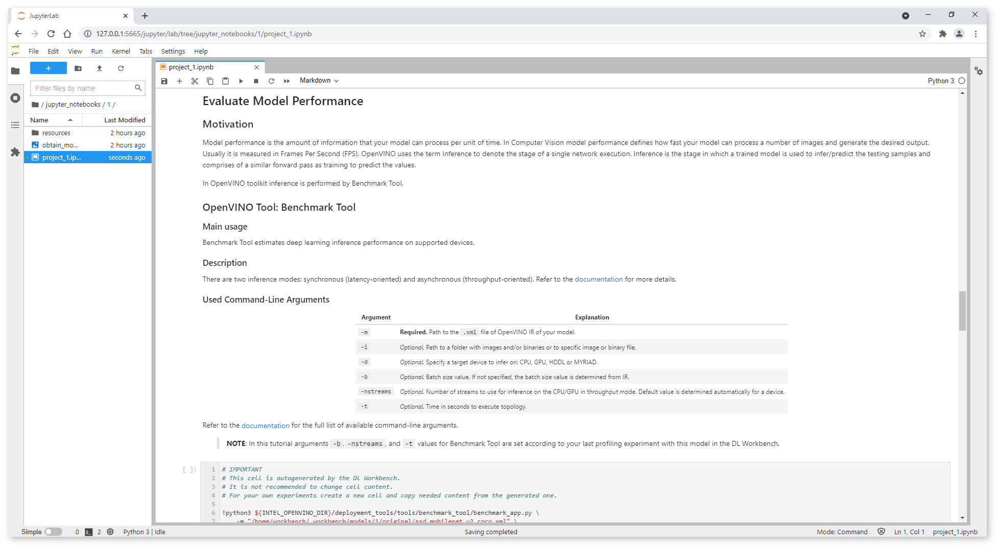
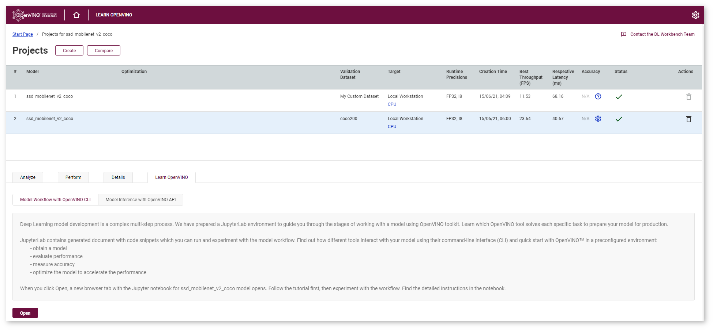
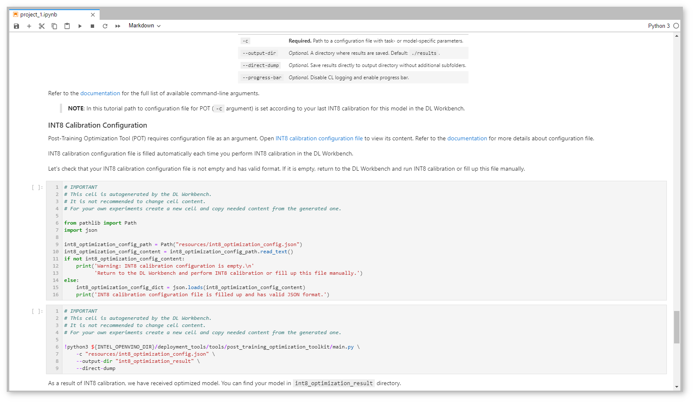

#  Learn Model Workflow with OpenVINO™ CLI in JupyterLab* Environment {#workbench_docs_Workbench_DG_Jupyter_Notebooks_CLI}

@sphinxdirective

.. toctree::
   :maxdepth: 1
   :hidden:

   workbench_docs_Workbench_DG_Jupyter_Notebooks
      
@endsphinxdirective

JupyterLab\* Notebooks delivered by the DL Workbench help to quick start with OpenVINO™ toolkit and learn how to use its command-line interface (CLI) by guiding you through full model workflow in the preconfigured environment. Learn which OpenVINO tool solves each specific task to prepare your model for production.

## OpenVINO Notebooks in DL Workbench 

You can experiment with the OpenVINO™ Toolkit using official ready-to-run Jupyter* notebooks right from the DL Workbench. The [JupyterLab*](https://jupyter-notebook.readthedocs.io/en/stable/) notebooks are running in the same environment as the DL Workbench. Open the **Learn OpenVINO** tab and go to **OpenVINO Notebooks**. Select and run the preconfigured notebook to learn the toolkit basics and use OpenVINO API for optimized deep learning inference. Learn more about each notebook at the OpenVINO Notebooks [GitHub repository](https://github.com/openvinotoolkit/openvino_notebooks).

## Learn Model Workflow with OpenVINO CLI

JupyterLab\* contains generated document with code snippets which you can run and experiment with the model workflow. Find out how different tools interact with your model using their command-line interface (CLI) and quick start with OpenVINO™ in a preconfigured environment:
	- obtain a model
	- evaluate performance
	- measure accuracy
	- optimize the model to accelerate the performance

## Notebook Contents

The Notebook contains the following steps:

1. Obtain Model in OpenVINO IR Format (Optional) - Learn how to obtain a model in Intermediate Representation (IR) format of pretrained model representation to start working with OpenVINO toolkit. Explore [Open Model Zoo](https://docs.openvinotoolkit.org/latest/omz_tools_downloader.html), Model Downloader, Model Converter and [Model Optimizer](https://docs.openvinotoolkit.org/latest/openvino_docs_MO_DG_Deep_Learning_Model_Optimizer_DevGuide.html) functionality. 
2. Evaluate Model Performance - Use your model to infer the testing samples to predict the values with [Benchmark Tool](https://docs.openvinotoolkit.org/latest/openvino_inference_engine_tools_benchmark_tool_README.html). 
3. Evaluate Model Accuracy - Evaluate the quality of predictions for the test data using [Accuracy Checker](https://docs.openvinotoolkit.org/latest/omz_tools_accuracy_checker.html).
4. Optimize Model with INT8 Calibration - Calibrate a model and execute it in the INT8 precision to accelerate the performance with [Post-Training Optimization Tool](https://docs.openvinotoolkit.org/latest/pot_README.html).

Each step describes the motivation behind the process, OpenVINO tools used to perform the operation, list of command-line arguments and code cells. 

## Access the JupyterLab

The [JupyterLab*](https://jupyter-notebook.readthedocs.io/en/stable/) environment works only if you have created a project. It is built
in the same Docker\* image as the DL Workbench. Refer to [Run DL Workbench instructions](Run_Workbench_Locally.md), to start DL Workbench.

* Open the **Learn OpenVINO** tab on the **Projects** page. Click **Open**, a new browser tab with the Jupyter notebook for your model opens. 

> **NOTE**: The environment opens in a new tab. Make sure your browser does not block pop-ups.

## How to Use the Notebook

The notebook is generated from DL Workbench. Note that performing actions and changing configurations in DL Workbench may change certain cells. It is not recommended to change these cells content to prevent information loss. For your own experiments create a new cell and copy needed content from the generated one. Changing the cells in the notebook will not affect the project in DL Workbench.

Some cells require making actions in DL Workbench to show the content. For example, accuracy measurment and optimization cells will be empty if you do not perform these steps in the tool:

---

## See Also

* [Learn Model Inference with OpenVINO API](Jupyter_Notebooks.md)
* [JupyterLab documentation](https://jupyter-notebook.readthedocs.io/en/stable/ui_components.html)
* [Troubleshooting](Troubleshooting.md)
