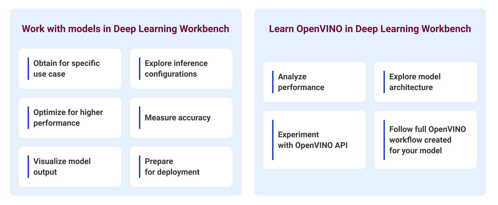
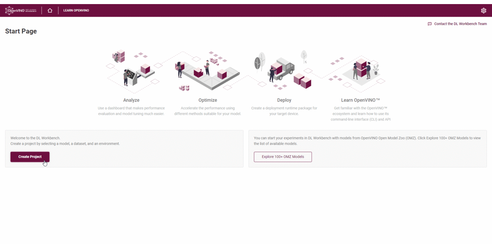

# OpenVINO™ Deep Learning Workbench Overview {#workbench_docs_Workbench_DG_Introduction}

Deep Learning Workbench (DL Workbench) is an official OpenVINO™ graphical interface designed to make the production of pretrained deep learning models significantly easier. 

DL Workbench combines OpenVINO™ tools to assist you with the most commonly used tasks: import a model, analyze its performance and accuracy, visualize the outputs, optimize and prepare the model for deployment in a matter of minutes. DL Workbench will take you through the full OpenVINO™ workflow, providing the opportunity to learn about various toolkit components.
 

@sphinxdirective

.. raw:: html

   <a href="workbench_docs_Workbench_DG_Install.html" class="button bttn-prm button-size-m" id="install-workbench">Install DL Workbench</a>

@endsphinxdirective

DL Workbench enables you to get a detailed performance assessment, explore inference configurations, and obtain an optimized model ready to be deployed on various Intel® configurations, such as client and server CPU, Intel® Processor Graphics (GPU), Intel® Movidius™ Neural Compute Stick 2 (NCS 2), and Intel® Vision Accelerator Design with Intel® Movidius™ VPUs.

DL Workbench also provides the [JupyterLab environment](Jupyter_Notebooks.md) that helps you quick start with OpenVINO™ API and command-line interface (CLI). Follow the full OpenVINO workflow created for your model and learn about different toolkit components. 

## Video

@sphinxdirective

.. list-table::

   * - .. raw:: html

           <iframe  allowfullscreen mozallowfullscreen msallowfullscreen oallowfullscreen webkitallowfullscreen  height="315" width="560"
           src="https://www.youtube.com/embed/on8xSSTKCt8">
           </iframe>
   * - **DL Workbench Introduction**. Duration: 1:31
     
@endsphinxdirective

## User Goals

DL Workbench helps achieve your goals depending on the stage of your deep learning journey. 

If you are a beginner in the deep learning field, the DL Workbench provides you with
learning opportunities:
* Learn what neural networks are, how they work, and how to examine their architectures. 
* Learn the basics of neural network analysis and optimization before production.
* Get familiar with the OpenVINO™ ecosystem and its main components without installing it on your system.

If you have enough experience with neural networks, DL Workbench provides you with a
convenient web interface to optimize your model and prepare it for production:
* Measure and interpret model performance.
* Tune the model for enhanced performance.
* Analyze the quality of your model and visualize output.

## General Workflow

The diagram below illustrates the typical DL Workbench workflow. Click to see the full-size image:

Get a quick overview of the workflow in the DL Workbench User Interface:

## OpenVINO™ Toolkit Components

The intuitive web-based interface of the DL Workbench enables you to easily use various
OpenVINO™ toolkit components:

Component  |                 Description 
|------------------|------------------|
| [Open Model Zoo](https://docs.openvinotoolkit.org/latest/omz_tools_downloader.html)| Get access to the collection of high-quality pre-trained deep learning [public](https://docs.openvinotoolkit.org/latest/omz_models_group_public.html) and [Intel-trained](https://docs.openvinotoolkit.org/latest/omz_models_group_intel.html) models trained to resolve a variety of different tasks. 
| [Model Optimizer](https://docs.openvinotoolkit.org/latest/openvino_docs_MO_DG_Deep_Learning_Model_Optimizer_DevGuide.html) |Optimize and transform models trained in supported frameworks to the IR format.  Supported frameworks include TensorFlow\*, Caffe\*, Kaldi\*, MXNet\*, and ONNX\* format.  
| [Benchmark Tool](https://docs.openvinotoolkit.org/latest/openvino_inference_engine_tools_benchmark_tool_README.html)| Estimate deep learning model inference performance on supported devices.   
| [Accuracy Checker](https://docs.openvinotoolkit.org/latest/omz_tools_accuracy_checker.html)| Evaluate the accuracy of a model by collecting one or several metric values. 
| [Post-Training Optimization Tool](https://docs.openvinotoolkit.org/latest/pot_README.html)| Optimize pretrained models with lowering the precision of a model from floating-point precision(FP32 or FP16) to integer precision (INT8), without the need to retrain or fine-tune models.                               |

@sphinxdirective

.. raw:: html

   <a href="workbench_docs_Workbench_DG_Install.html" class="button bttn-prm button-size-m" id="install-workbench">Install DL Workbench</a>

@endsphinxdirective

## Contact Us

* [DL Workbench on Intel Community Forum](https://community.intel.com/t5/Intel-Distribution-of-OpenVINO/bd-p/distribution-openvino-toolkit)

* [DL Workbench Gitter Chat](https://gitter.im/dl-workbench/general?utm_source=badge&utm_medium=badge&utm_campaign=pr-badge&content=body)