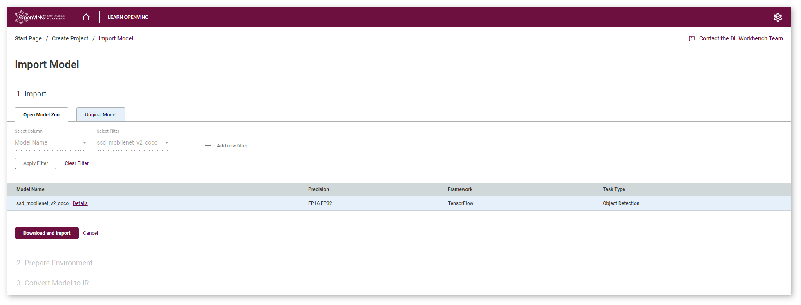
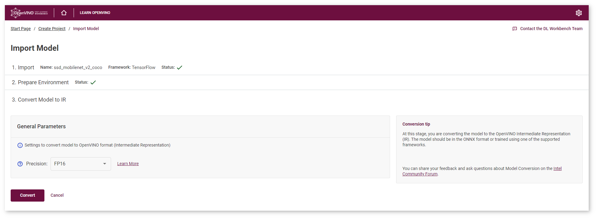
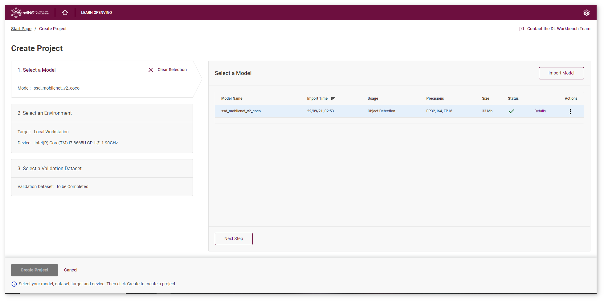
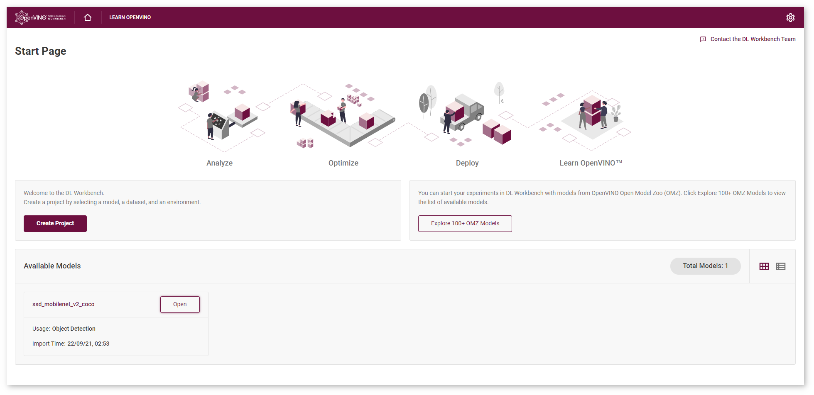
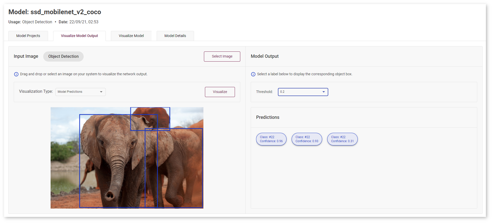
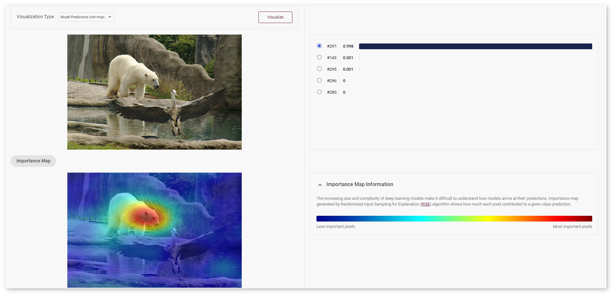

# Import Model {#workbench_docs_Workbench_DG_Select_Model}

This document describes the first part of [Get Started with DL Workbench](Work_with_Models_and_Sample_Datasets.md) workflow, following the model import steps from the Create Project video.

@sphinxdirective

.. list-table::

   * - .. raw:: html

           <iframe  allowfullscreen mozallowfullscreen msallowfullscreen oallowfullscreen webkitallowfullscreen height="315" width="560"
           src="https://www.youtube.com/embed/gzUFYxomjn8">
           </iframe>
   * - **Get Started with the DL Workbench**. Duration: 8:27
     
@endsphinxdirective

To start working with DL Workbench, you need to obtain a model. A model is a neural network that has been trained over a set of data using a certain frameworks, such as TensorFlow\*, ONNX\*, Caffe\*, MXNet\*, and others. 

There are two ways to import a model in DL Workbench: 
- Select a model from the Open Model Zoo. Open Model Zoo includes a set of high-quality pretrained Deep Learning [public](https://docs.openvinotoolkit.org/latest/omz_models_group_public.html) and [Intel-trained](https://docs.openvinotoolkit.org/latest/omz_models_group_intel.html) models for different use cases, such as classification, object detection, segmentation and many others. 
- Import your [original model](Select_Models.md). Upload the files and start the import if you have a model pretrained in one of the supported frameworks or you already have an Intermediate Representation(IR) model.

This document focuses on importing a model from the Open Model Zoo. If you want to learn about importing original model, see the [Obtain Models](Select_Models.md) page. 

## Download Model

First, you need to select a model. Click **Explore 100+ OMZ Models** on the start page.

This guide uses `ssd_mobilenet_v2_coco` SSD [model](https://docs.openvinotoolkit.org/latest/omz_models_model_ssd_mobilenet_v2_coco.html) for [object detection](https://machinelearningmastery.com/object-recognition-with-deep-learning/) use case, pretrained with [TensorFlow\*](https://www.tensorflow.org/) framework. Type the name in the search, select the model and click **Download and Import**. During this step, you can also inspect the model details. 

## Convert Model

To work with DL Workbench, you need to obtain a model in the Intermediate Representation (IR) format. Specify the precision in which model weights should be stored to convert the selected TensorFlow\* model to IR. You can select either 32-bit (FP32) or 16-bit (FP16) floating-point values. In this tutorial we choose FP16, as it keeps good accuracy and provides smaller footprint. Select the precision and click **Convert**.

You will be redirected to the **Create Project** page, where you can check the import status.

You have completed the first part of [Get Started with DL Workbench](Work_with_Models_and_Sample_Datasets.md) guide. The next step is to [create a project](Create_Project.md). 
Before creating a project, you can find out how your model works on test images. 

## Optional. Visualize Model

To check your model and explore its properties, click **Open** under the **Actions** column. 

The **Model Page** will open. You can also access this page from the **Start Page** where all imported models are displayed:

On this page you can see the list of available model projects, visualize the model structure and output, read information about theoretical analysis, conversion settings, and accuracy configurations.

Drag and drop your image to evaluate the model performance:

### Visualize Model Predictions with Importance Map

> **NOTE**: The feature is available for models of classification use case

Although deep neural models are widely used to automate data processing, 
their decision-making process is mostly unknown and difficult to explain. 
Explainable AI helps you understand and interpret model predictions. 

Randomized Input Sampling for Explanation (RIZE) algorithm can explain why a black-box model makes
classification decisions by generating a pixel importance map for each class.
The algorithm tests the model with randomly masked versions of the input image and obtains 
the corresponding outputs to evaluate the importance.

Select Model Predictions with Importance Map visualization type, upload an image and click **Visualize** button. You will see the progress bar on the right.

In the images below, red area indicates the most important pixels for class #269 (polar bear). Blue area contains less important pixels for the corresponding model prediction.  

Select another prediction to show the heatmap for class #143 (crane).

Once you have checked how the model works, proceed to [create a project](Create_Project.md) to further explore the DL Workbench capabilities.

*All images were taken from ImageNet, Pascal Visual Object Classes, and Common Objects in Context datasets for demonstration purposes only.*

## See Also

* [Next Step: Create Project](Create_Project.md)
* [Troubleshooting](Troubleshooting.md)
