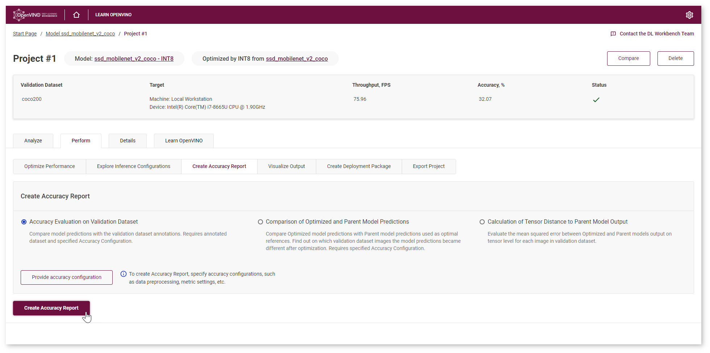
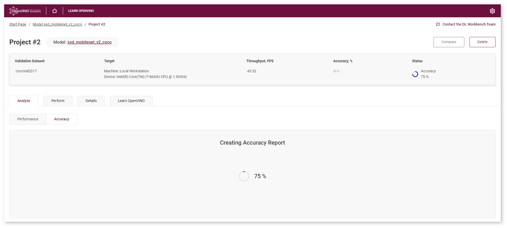
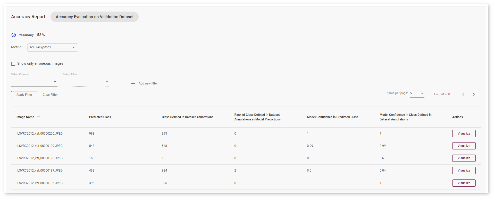
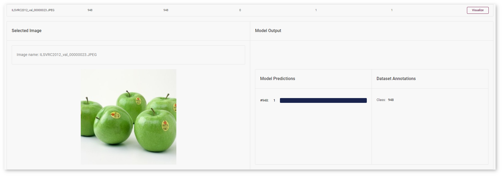
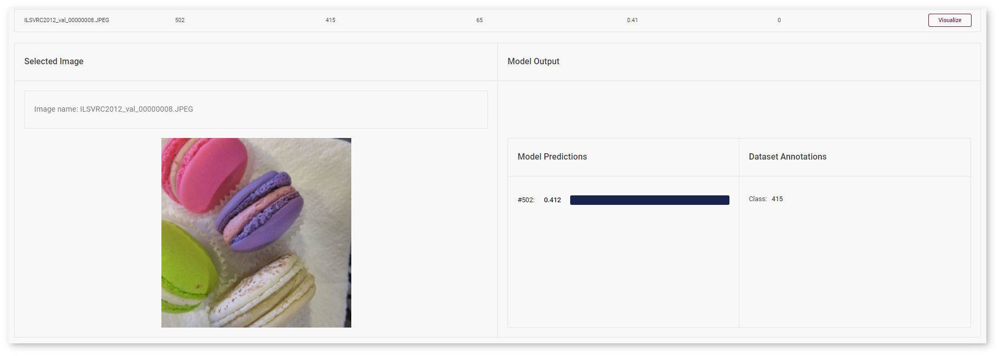

# Classification Model Tutorial {#workbench_docs_Workbench_DG_Measure_Accuracy_Classification}

Accuracy measurement is an important stage of profiling your model in the DL Workbench. Along with performance, accuracy is crucial for assessing model quality. 

| Model  | Task Type | Framework | Source | Dataset |
| :---: | :---: | :---: | :---: |:---: |
| [squeezenet.1.1](https://docs.openvinotoolkit.org/latest/omz_models_model_squeezenet1_1.html)  | [Classification](https://paperswithcode.com/task/image-classification) | [Caffe\*](https://caffe.berkeleyvision.org/) | [Open Model Zoo](https://github.com/openvinotoolkit/open_model_zoo/tree/master/models/public/squeezenet1.1)| [ImageNet 2012 validation](https://image-net.org/index.php) |

 Refer to the [Get Started with DL Workbench](Work_with_Models_and_Sample_Datasets.md) to learn how to import a model and a dataset. 

> **TIP**: If you have optimized the model using [INT8 Calibration](Int-8_Quantization.md), you can use a Not Annotated dataset to compare original and optimized model predictions. 

Once you select a model and a dataset and run a baseline inference, the **Projects** page appears. Go to the **Perform** tab and select **Create Accuracy Report**:

## Create Accuracy Evaluation on Validation Dataset Report

Accuracy Evaluation on Validation Dataset report provides information for evaluating model quality and allows you to compare the model output and validation dataset annotations. Select the report type and click **Provide Accuracy Configuration** button. Refer to the [Accuracy Configurations page](Accuracy_Configuration.md) to learn about different accuracy settings.

After you click **Create Accuracy Report**, you will be redirected to the **Analyze** tab, where  you can check the status of Accuracy Report creation:

> **NOTE**: Accuracy measurements are performed on each dataset image. Creating an Accuracy Report may take some time if the dataset is considerably large. 

## Interpret Report Results 

Accuracy is measured on the validation dataset images. The model suggests the **Predicted Class** of the objects on images. You can compare this class with the **Class Defined in Dataset Annotations**. 

If the classes do not match, the model must be incorrect. To assess the difference between the classes, check the **Rank of Class Defined in Dataset Annotations in Model Predictions**. You can compare **Model Confidence in Predicted Class** with **Model Confidence in Class Defined in Dataset Annotations**. 

Click **Visualize** button under the **Actions** column to compare the predictions and annotations for a particular image.

In the example image, the `squeezenet.1.1` model predicted the same class as specified in dataset annotations (apple) with confidence equaled 1.

Check **Show only erroneous images** option to display only images where the classes predicted by the model and specified in dataset annotations do not match. 

Here the model predicted class 502 (shoes) with a confidence equal to 0.41. The actual class from dataset annotations is 415 (bakery) and has rank 65 in the model predictions as the model confidence for this class equals 0.

> **TIP**: You can enhance your model performance while ensuring that the model accuracy has not decreased dramatically. For that, [optimize your model](Int-8_Quantization.md) and create an Accuracy Report that allows you to visualize and [compare Optimized and Parent model predictions](Tutorial_classification.md). 

*All images were taken from ImageNet, Pascal Visual Object Classes, and Common Objects in Context datasets for demonstration purposes only.*

## See Also

* [Object Detection model tutorial](Tutorial_object_detection_dataset.md)
* [Optimize Object Detection model tutorial](Tutorial_object_detection.md)
* [Optimize Classification model tutorial](Tutorial_classification.md)
* [Optimize Style Transfer model tutorial](Tutorial_style_transfer.md)
* [Accuracy Checker](https://docs.openvinotoolkit.org/latest/omz_tools_accuracy_checker.html)
* [Configure Accuracy Settings](Accuracy_Configuration.md)
* [Troubleshooting](Troubleshooting.md)