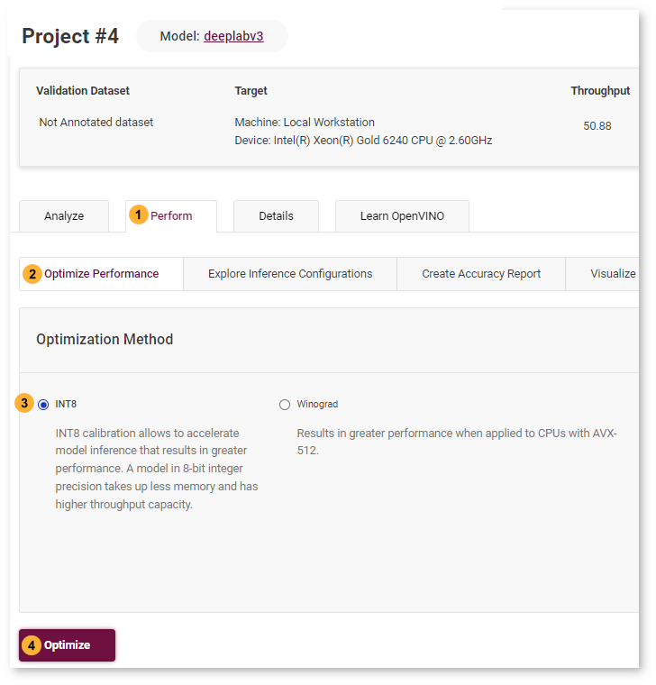
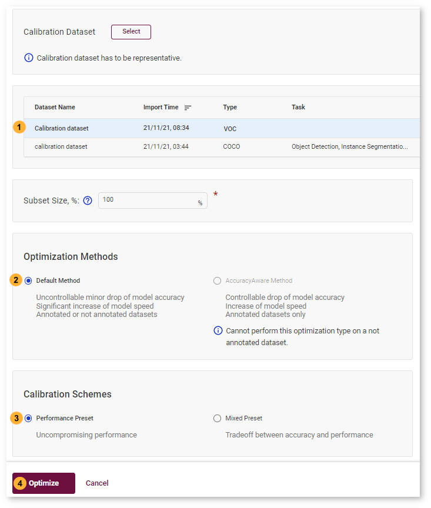
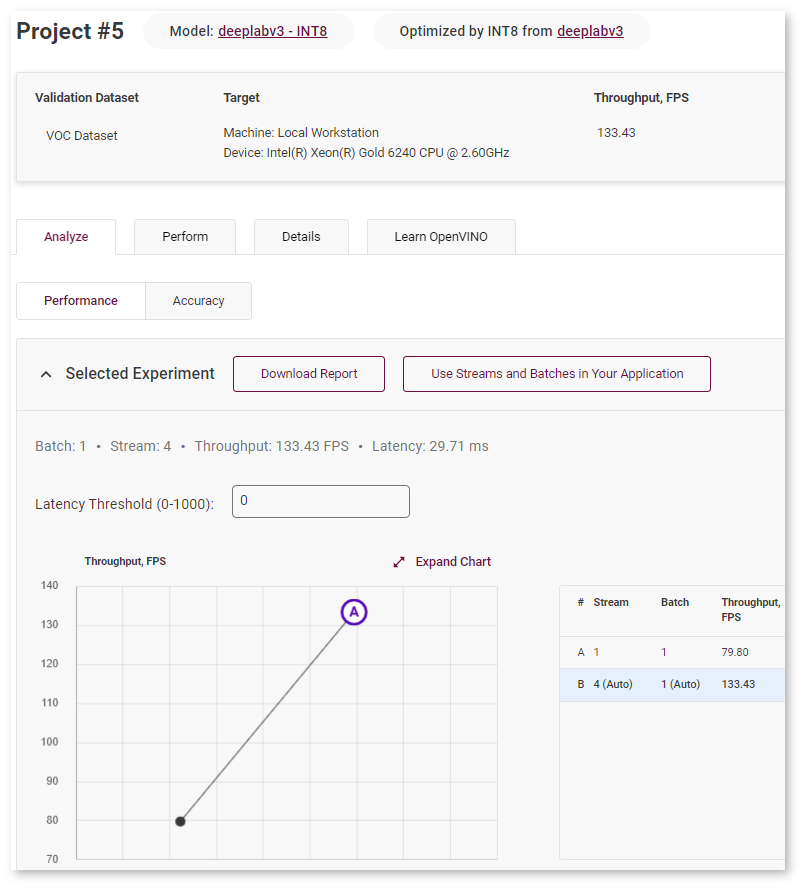
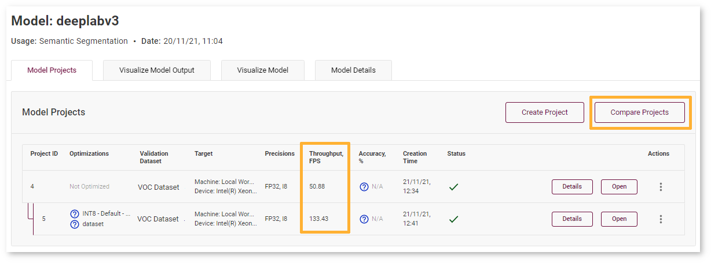
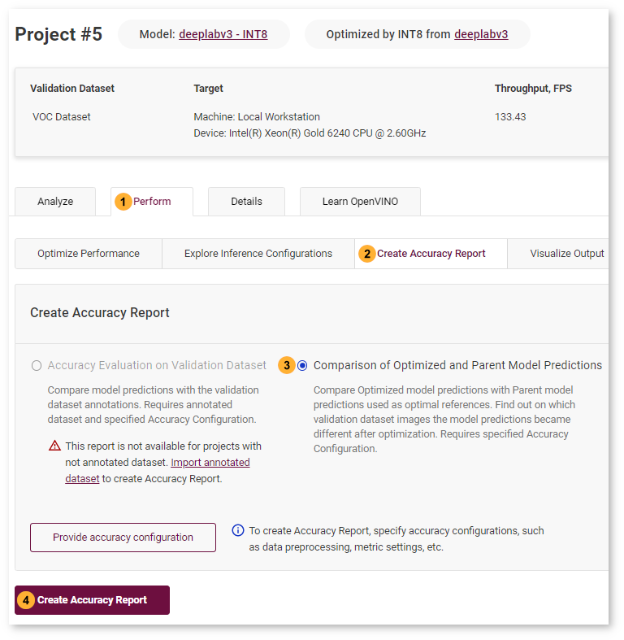
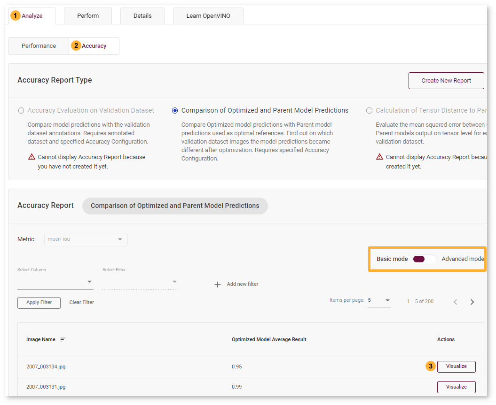
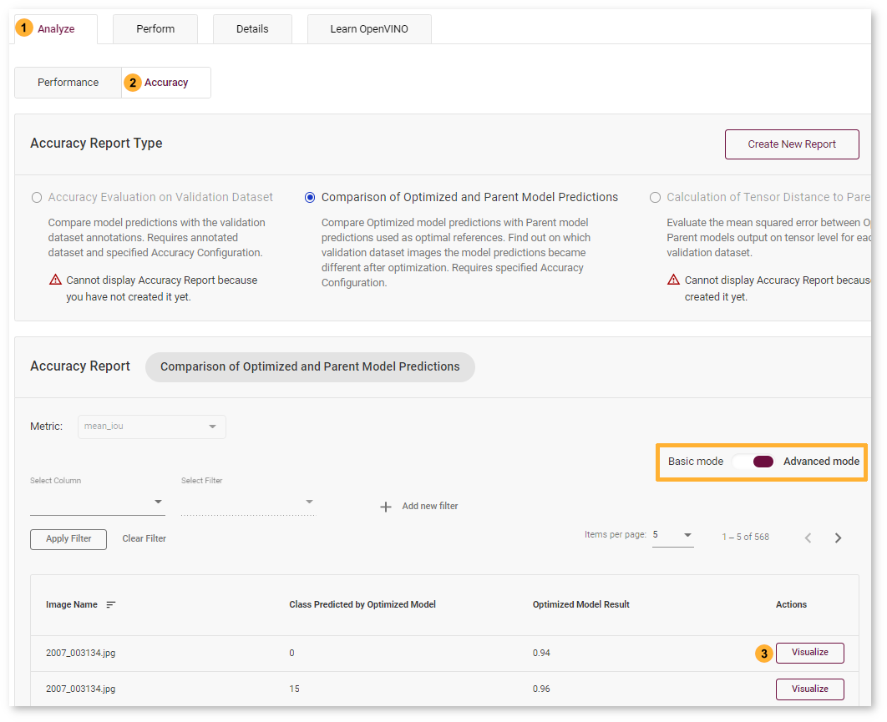
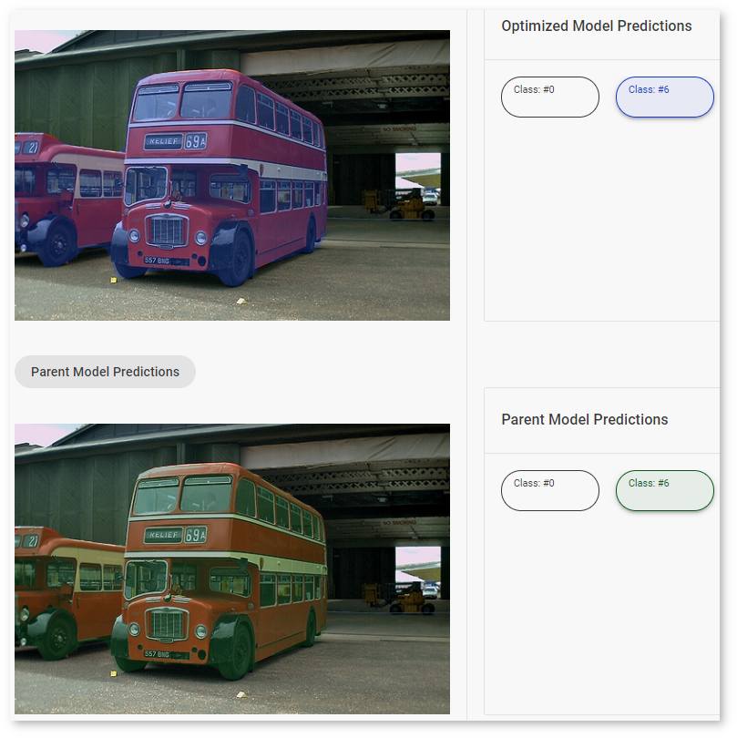
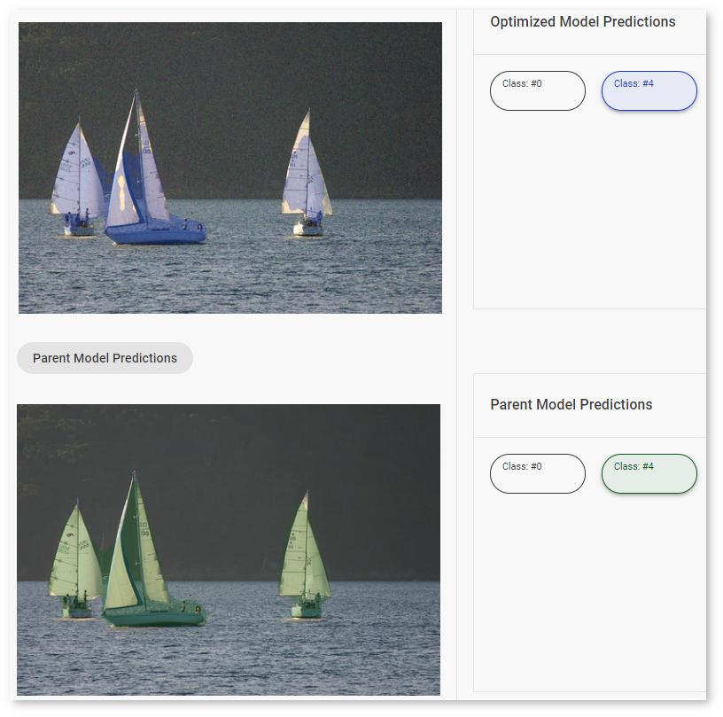

# Optimize Semantic Segmentation Model {#workbench_docs_Workbench_DG_Tutorial_Semantic_Segmentation}

## Summary

INT8 Calibration is a universal method for accelerating deep learning models. Calibration is a process of converting a Deep Learning model weights to a lower 8-bit precision such that it needs less computation.

In this tutorial, you will learn how to optimize your model using INT8 Calibration, examine how much quicker the model has become, and check the difference between original and optimized model accuracy. 

| Model  | Task Type | Format | Source | Dataset |
| :---: | :---: | :---: | :---: |:---: |
| [deeplabv3](https://docs.openvinotoolkit.org/latest/omz_models_model_fast_neural_style_mosaic_onnx.html)  | [Semantic Segmentation](https://paperswithcode.com/task/semantic-segmentation) | [TensorFlow\*](https://www.tensorflow.org/) | [Open Model Zoo](https://github.com/openvinotoolkit/open_model_zoo/tree/master/models/public/deeplabv3)| [Pascal Visual Object Classes (Pascal VOC)](Dataset_Types.md) |

> **TIP**: You can learn how to [import a model](Select_Model.md) and [a dataset](Create_Project.md) in the DL Workbench [Get Started Guide](Work_with_Models_and_Sample_Datasets.md).

> **NOTE**: For deeplabv3 model, it is highly recommended to use [Pascal VOC](https://docs.openvino.ai/latest/workbench_docs_Workbench_DG_Dataset_Types.html#pascal-visual-object-classes-pascal-voc) dataset to get the accurate results.

## Optimize Model Using INT8 Calibration

To convert the model to INT8, go to  **Perform** tab on the Project page and open **Optimize** subtab. Check **INT8** and click **Optimize**.

It takes you to the **Optimize INT8** page. Select the imported dataset and perform INT8 Calibration with Default optimization method and Performance Preset calibration scheme first as it provides maximum performance speedup.

After optimization, you will be redirected to a new Project page for optimized  `deeplabv3` model. 

To ensure that the optimized model performance is sufficiently accelerated and its predictions can be trusted, evaluate the key characteristics: performance and accuracy.

## Compare Optimized and Parent Model Performance

Go back to the model page and check the performance of the imported and optimized models. Compare the throughput numbers and click **Compare Projects** button to see more details. Learn more about projects comparison on the [Compare Performance](Compare_Performance_between_Two_Versions_of_Models.md) page.

> **NOTE**: Throughput is the number of images processed in a given amount of time. It is measured in frames per second (FPS). Higher throughput value means better performance.

You can observe that `deeplabv3` model has become 2.6x times faster on CPU device after optimization. 

Lowering the precision of the model using quantization leads to a loss in prediction capability. Therefore you need to assess the model prediction capability to ensure that the model has not lost a significant amount of accuracy. 

## Compare Parent and Optimized Model Predictions 

### Create Accuracy Report

Create an Accuracy Report that allows you to visualize and compare Optimized and Parent model predictions. Go to the **Perform** tab and select **Create Accuracy Report**:

Comparison of Optimized and Parent Model Predictions Report allows you to find out on which validation dataset images the predictions of the model have become different after optimization. Let's compare Optimized model predictions with Parent model predictions used as optimal references. 

### Interpret Report Results

The Report has two display options: Basic and Advanced mode. Each line of the report table in basic mode contains an **Image Name** and **Optimized Model Average Result** for all objects in the image. Advanced mode shows **Class Predicted by Optimized Model**.

Basic mode:
    

  
Advanced mode:

> **TIP:**  To sort the numbers from lowest to highest, click on the parameter name in the table.

Click **Visualize** to see the prediction difference:

In our case, the optimized `deeplabv3` model recognized all object of class #6 - buses. You can see that the clustering parts for each object coincide in Optimized and Parent model predictions.

In another example, clustering parts for each object in Optimized `deeplabv3` predictions are less accurate than  the Parent model prediction. 

## Next Step

After evaluating the accuracy, you can decide whether the difference between imported and optimized models predictions is critical or not:

- If the tradeoff between accuracy and performance is too big, [import an annotated dataset](Import_Datasets.md) and use [AccuracyAware optimization method](Int-8_Quantization.md#accuracyaware), then repeat the steps from this tutorial.

- If the tradeoff is acceptable, [explore inference configurations](Deploy_and_Integrate_Performance_Criteria_into_Application.md) to further enhance the performance. Then create a [deployment package](Deployment_Package.md) with your ready-to-deploy model. 

*All images were taken from ImageNet, Pascal Visual Object Classes, and Common Objects in Context datasets for demonstration purposes only.*

## See Also

* [Create Accuracy Report](Measure_Accuracy.md)
* [Object Detection model tutorial](Tutorial_object_detection_dataset.md)
* [Classification model tutorial](Tutorial_classification_dataset.md)
* [Optimize Classification model tutorial](Tutorial_classification_dataset.md)
* [Optimize Object Detection model tutorial](Tutorial_object_detection.md)
* [Configure Accuracy Settings](Accuracy_Configuration.md)
* [Troubleshooting](Troubleshooting.md)