# Visualize Model Output {#workbench_docs_Workbench_DG_Visualize_Accuracy}

DL Workbench enables you to visually estimate how well a model recognizes images by testing the
model on particular sample images.
This functionality considerably enhances the analysis of inference results, giving you an opportunity not only to estimate the performance, but also to visually understand whether the model works correctly and the accuracy is tolerable for client applications.  

To get a visual representation of the output of your model, go to the **Perform**
tab on the **Projects** page and open the **Visualize Output** tab.

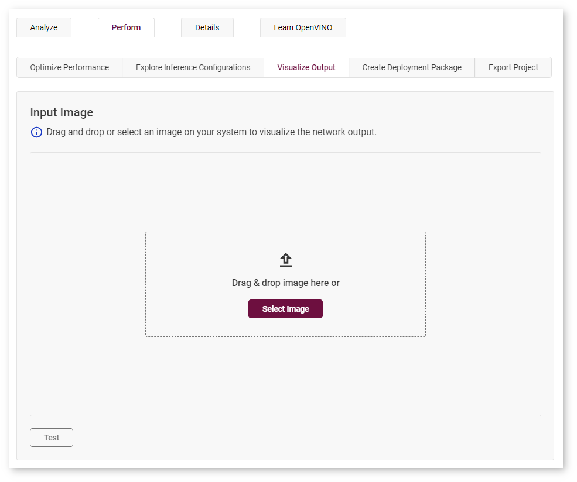

There are three ways to visualize model output in the DL Workbench:

* <a href="#model-predictions">Model Predictions</a>
* <a href="#xai">Model Predictions with Importance Map</a>
* <a href="#compare-model-predictions">Optimized and Parent Model Predictions</a>

## Model Predictions

> **NOTE**: The feature is available for models trained for the following tasks:
> * Classification
> * Object-Detection
> * Instance-Segmentation
> * Semantic-Segmentation
> * Super-Resolution
> * Style-Transfer
> * Image-Inpainting

Select an image on your system or drag and drop an image directly. Click **Test**, and the model
predictions appear on the right.

## Classification Models

Predictions for a classification model with corresponding confidence levels are sorted from the highest
confidence rate to the lowest.

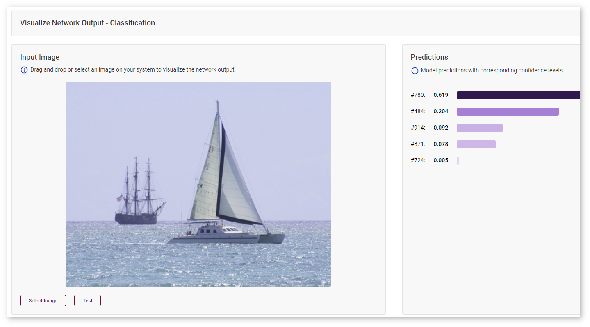

## Object-Detection Models

With object-detection models, you can visualize bounding boxes by hovering your mouse over a class prediction on the right. 
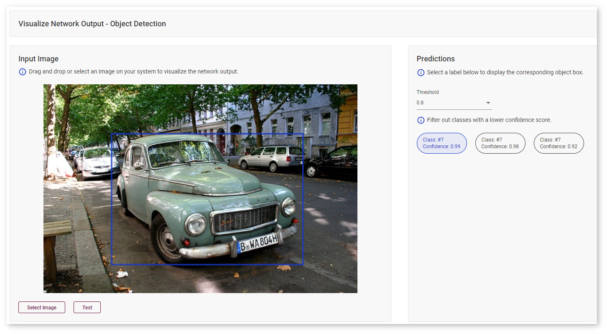
Use the **Threshold** drop-down list to filter classes based on the confidence score.

## Instance-Segmentation Models

With instance-segmentation models, you can visualize masks by hovering your mouse over a class
prediction on the right. 
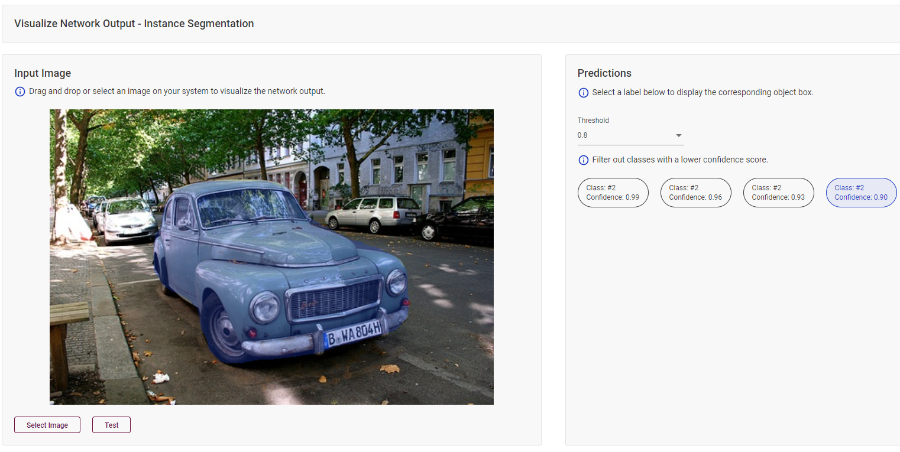 
Use the **Threshold** drop-down list to filter classes
based on the confidence score.

## Semantic-Segmentation Models

For semantic-segmentation models, the DL Workbench provides areas of categorized objects, which
enables you to see whether your model recognized all object types, like the buses in this image:
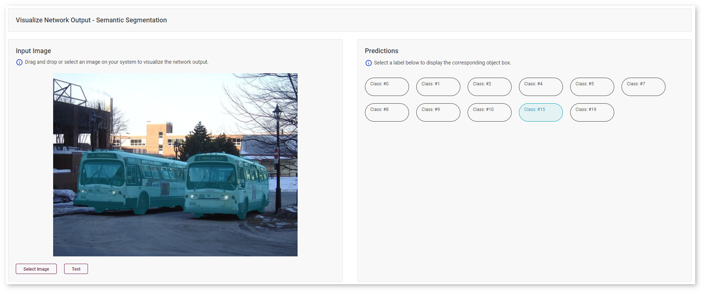
Or the road in the same image:
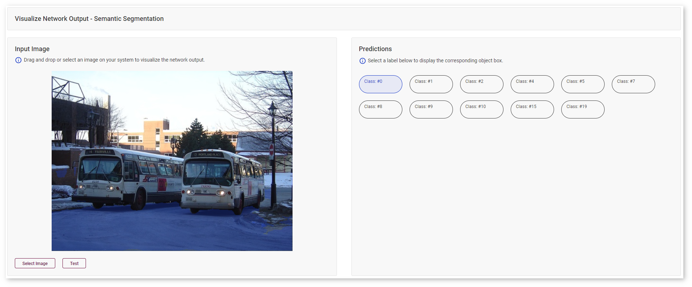

## Super-Resolution Models

Asses the performance of your super-resolution model by looking at a higher-resolution image on the right:
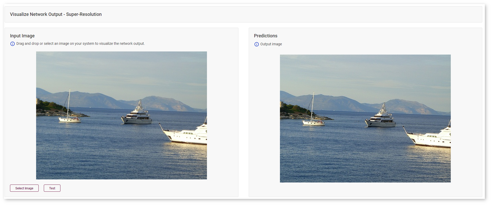

## Style-Transfer Models

For style-transfer models, see the style for which your model was trained applied to a sample image:
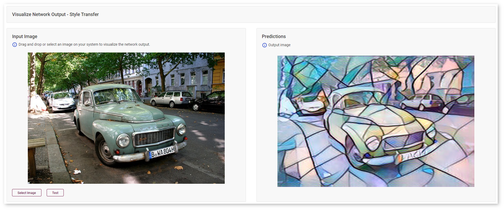

## Image-Inpainting Models

With image-inpainting models, select areas that you want to inpaint on your test image by drawing rectangles.
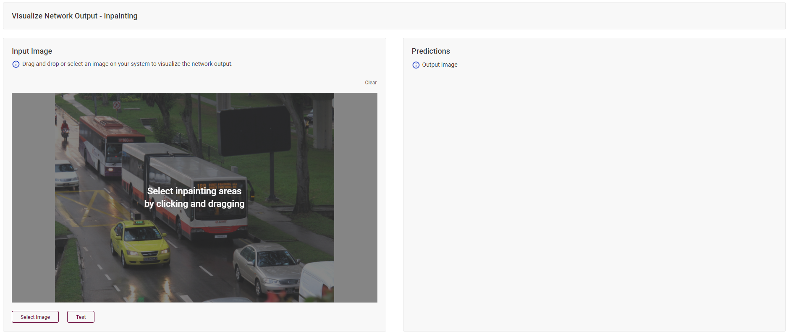
In this example, the goal is to conceal license plates. Click **Test** and see the result on the right.
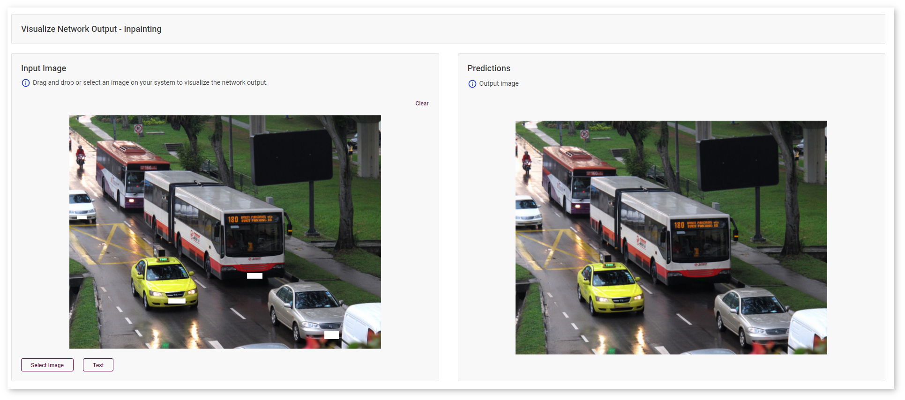

## <a name="xai">Model Predictions with Importance Map</a>

> **NOTE**: The feature is available for models trained for the Classification use case

Although deep neural models are widely used to automate data processing, 
their decision-making process is mostly unknown and difficult to explain. 
Explainable AI helps you understand and interpret model predictions. 

Randomized Input Sampling for Explanation (RIZE) algorithm can explain why a black-box model makes
classification decisions by generating a pixel importance map for each class.
The algorithm tests the model with randomly masked versions of the input image and obtains 
the corresponding outputs to evaluate the importance.

Select Model Predictions with Importance Map visualization type, upload an image and click **Visualize** button. You will see the progress bar on the right.

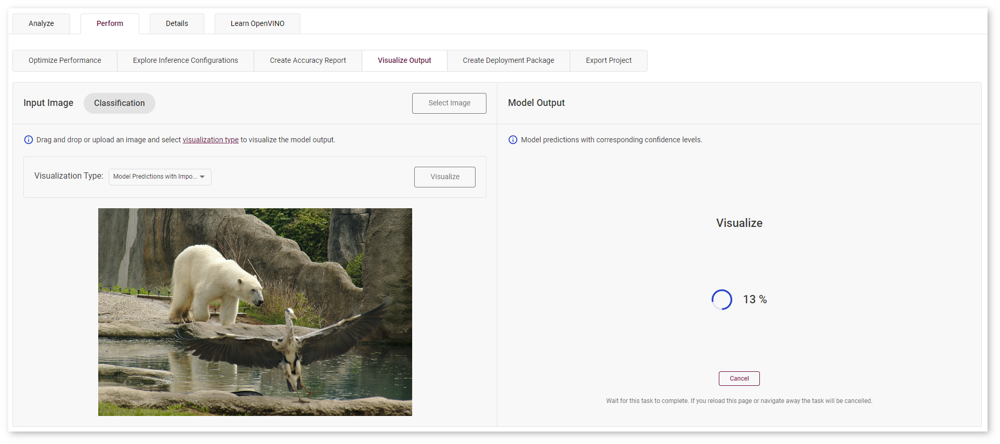

In the images below, red area indicates the most important pixels for class #269 (polar bear). Blue area contains less important pixels for the corresponding model prediction.  

Select another prediction to show the heatmap for class #143 (crane).

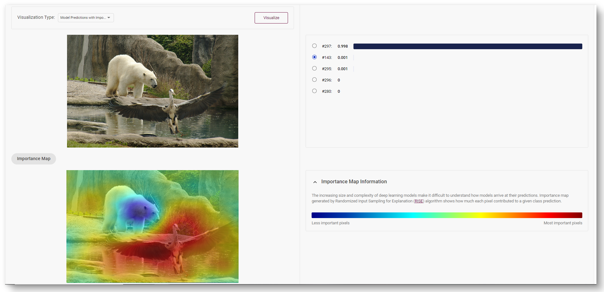

Learn more about the RISE algorithm in this [paper](https://arxiv.org/pdf/1806.07421.pdf).

## Compare Optimized and Parent Model Predictions

> **NOTE**: The feature is available for optimized models

 You can compare Optimized model predictions with Parent model predictions used as optimal references. Find out on which validation dataset images the predictions of the model became different after optimization. Learn more at the [Create Accuracy Report page](Measure_Accuracy.md).

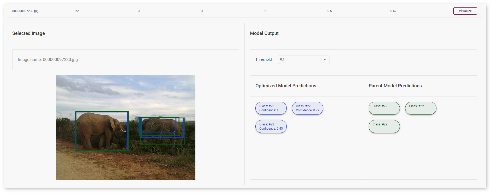

> *All images were taken from ImageNet, Pascal Visual Object Classes, and Common Objects in Context datasets for demonstration purposes only.*

## See Also

* [Visualize Model](Visualize_Model.md)
* [View Inference Results](Visualize_Model.md)
* [Troubleshooting](Troubleshooting.md)

